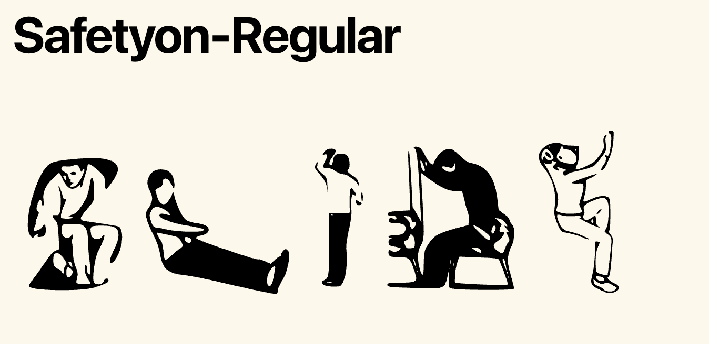

# Safetyon

  A typeface inspired by the diagrams on Ryanair safety cards — specifically
  the
  figure of a woman crossing her arms while sliding down an emergency chute,
  her
  body forming a perfect 'X'. The whole alphabet came out of that one pose.

  ## Download
  - [Safetyon-Regular.ttf](Safetyon-Regular.ttf)
  - [Safetyon-Regular.zip](Safetyon-Regular.zip)

  ## License
  SIL Open Font License 1.1 — free to use, modify, and redistribute.

  ## Designer
  Julie Moscatelli — [julie-moscatelli.com](https://juliemoscatelli.com)
